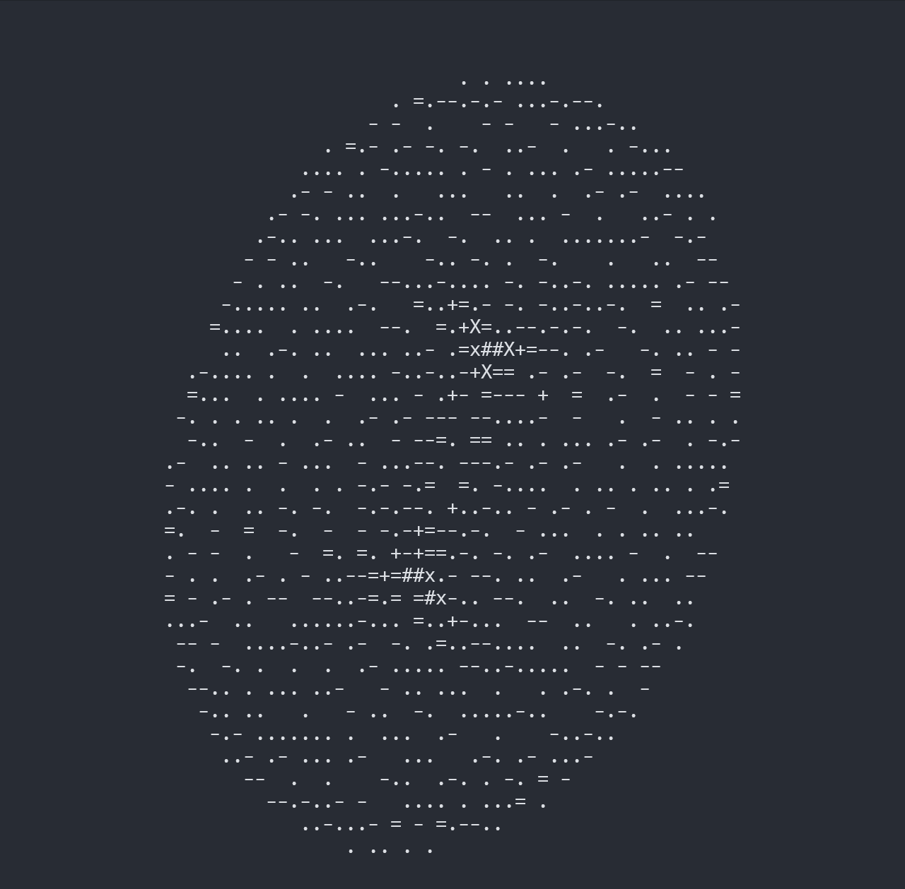

# term3d
3d object projection in terminal.



## Overview

One of the assignment of 42Tokyo.\
This program that projects 3d point cloud file in terminal.

## Usage

```
git clone https://github.com/nakamo326/term3d.git
cd term3d && make
./term3d resources/torus.3d
```

There are some 3d file sample in resources dir.

## Features

WASD: rotate object\
space: toggle rotate\
HL: rotate camera with Y axis\
JK: rotate camera with X axis\
UI: rotate camera with Z axis\
R: zoom out\
F: zoom in\
Q: quit

## Co-developer
[Taisei Toya](https://github.com/ToYeah)\
Thanks a lot!